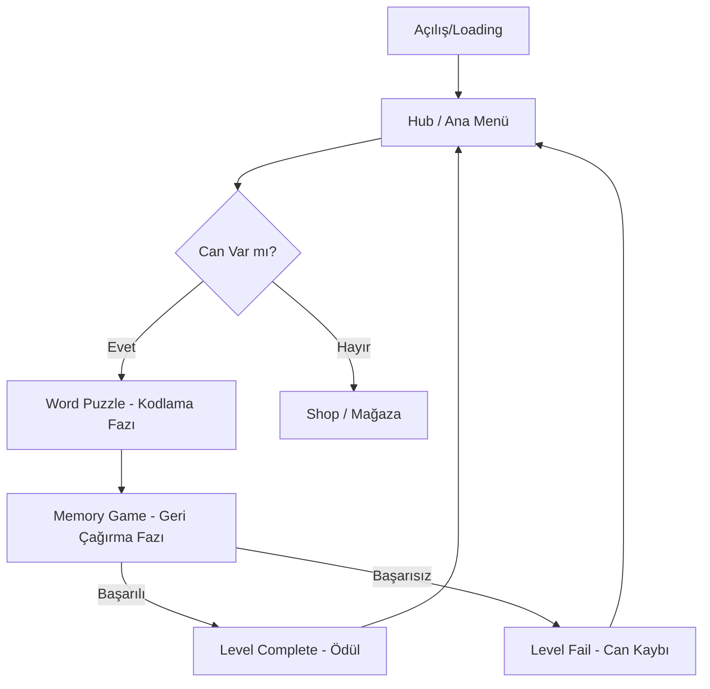

# Lumina Quest - Teknik Mimari ve Bakım Dokümantasyonu (v15.0.0)

Bu doküman, **Lumina Quest** projesinin teknik altyapısını, mühendislik kararlarını ve sistem bakım süreçlerini detaylandırmak amacıyla Kıdemli Yazılım Mimarları tarafından hazırlanmıştır. Lumina Quest, saf web teknolojileriyle (React 19, CSS 3D) AAA kalitesinde mobil oyun deneyimi sunan hibrit bir yapıdır.

---

## 1. Oyun Genel Bakışı (Technical Overview)

Lumina Quest, bilişsel fonksiyonları (mekansal bellek, odaklanma, örüntü tanıma) geliştirmek üzere tasarlanmış, **Hyper-casual / Puzzle** türünde bir mobil web uygulamasıdır.

- **Hedef Platformlar:** iOS (Safari/PWA), Android (Chrome/PWA), WebView tabanlı mobil sarmalayıcılar (Capacitor/Cordova).
- **Minimum Gereksinimler:** 
  - Donanım: 2GB RAM, WebGL & CSS Grid destekli GPU.
  - Yazılım: iOS 14+, Android 8+ (Modern tarayıcı motoru).

---

## 2. Proje Yapısı ve Mimarisi

### 2.1. Klasör Hiyerarşisi
```text
/root
├── components/          # Atomik ve moleküler UI bileşenleri (Button, Cube3D, Header)
├── lib/                 # Servis katmanları ve harici entegrasyonlar (Firebase, GenAI)
├── managers/            # Singleton servis yöneticileri (SoundManager)
├── screens/             # Oyun ekranları (Loading, Hub, WordPuzzle, MemoryGame)
├── types.ts             # Global TypeScript interface ve enum tanımları
├── App.tsx              # Merkezi State Machine ve Root Provider
├── Kelimeler.csv        # Oyunun master veri matrisi
└── index.html           # Giriş kapısı ve global GPU animasyon tanımları
```

### 2.2. Tasarım Desenleri (Design Patterns)
- **Singleton Pattern:** `SoundManager.ts` üzerinde uygulanmıştır. Tek bir AudioContext üzerinden tüm ses sentezleme süreçleri yönetilir.
- **State Machine Pattern:** `App.tsx` içerisindeki `GameState` enum'u ile oyunun yaşam döngüsü (Loading -> Hub -> Game -> Result) yönetilir.
- **Component-Based Architecture:** Tüm UI öğeleri React'in atomik tasarım ilkelerine göre modülerleştirilmiştir.

### 2.3. Oyun Döngüsü (Game Loop) - Mermaid.js


---

## 3. Temel Sistemler (Core Mechanics)

### 3.1. Giriş (Input) Yönetimi
Mobil odaklı olduğu için dokunmatik (Touch) girdiler optimize edilmiştir. `index.html` üzerindeki `touch-action: none` ve `-webkit-tap-highlight-color: transparent` tanımları ile tarayıcı varsayılanları devre dışı bırakılmış, saf oyun hissiyatı sağlanmıştır.

### 3.2. DDS (Difficulty Dynamic Scale) Algoritması
Oyunun zorluğu, oyuncunun anlık performansına göre dinamik olarak hesaplanır:
```typescript
const currentDDS = useMemo(() => {
  const baseDDS = WordDatabase.getDDSForGate(stats.level);
  const streakBonus = stats.streak * 0.05; // Her doğru seri zorluğu %5 artırır
  return parseFloat((baseDDS + streakBonus).toFixed(2));
}, [stats.level, stats.streak]);
```

### 3.3. Kolektif Hareket Motoru
Kelimelerin 3B uzaydaki dizilimi için 20+ matematiksel koreografi kullanılır. Örnek Figure-8 (Sonsuzluk) kodu:
```typescript
const calculateFigure8 = (rad: number, d: number) => ({
  x: Math.sin(rad) * d,
  y: Math.sin(rad * 2) * (d / 2),
  z: Math.cos(rad) * 20
});
```

---

## 4. Varlık ve Bellek Yönetimi (Assets & Memory)

### 4.1. The Lumina Engine (CSS 3D)
Geleneksel bir oyun motoru (Unity/Unreal) yerine, bellek tüketimini minimize etmek için GPU hızlandırmalı CSS `transform-style: preserve-3d` kullanılmıştır.
- **Avantajı:** Ekstra bir motor yüklemesi gerektirmez, 10-15 MB bellek ile çalışabilir.
- **Optimizasyon:** `Cube3D` bileşeni `React.memo` ile sarmalanarak gereksiz render süreçleri engellenmiştir.

### 4.2. Prosedürel Ses (DDS-Audio)
Dosya boyutunu düşürmek için MP3/WAV dosyaları yerine Web Audio API osilatörleri kullanılmıştır:
- `Sine Wave`: Yumuşak geçişler ve arayüz sesleri.
- `Sawtooth/Triangle`: Başarı ve hata sinyalleri.
- Zorluk derecesine (DDS) göre ses frekansları `(Base_Freq * DDS)` formülüyle tizleşir veya kalınlaşır.

---

## 5. Veri Saklama ve Backend (Persistence)

### 5.1. Hibrit Kayıt Sistemi
1. **LocalStorage:** Milisaniyelik gecikme olmaksızın yerel cihazda anlık durum koruması sağlar.
2. **Firebase Firestore:** Kullanıcı giriş yaptığında bulut senkronizasyonu devreye girer.
3. **Uzlaştırma (Reconciliation):** Cihazdaki veri ile buluttaki veri çakışırsa `level` ve `stars` bazlı en yüksek veri kabul edilir.

```typescript
export const reconcileStats = (local: UserStats, cloud: UserStats): UserStats => {
  return cloud.level > local.level ? cloud : local;
};
```

---

## 6. Üçüncü Parti Entegrasyonlar (SDKs)

### 6.1. Google Gemini API (GenAI)
`lib/ai.ts` üzerinden entegre edilen SDK, gelecekteki "Dinamik Lore/Hikaye Üretimi" için hazırdır. 
- **Model:** `gemini-3-flash-preview`
- **Görev:** Oyuncu performans verilerini analiz ederek kişiselleştirilmiş motivasyon mesajları üretmek.

### 6.2. Firebase Suite
- **Auth:** Google ve Facebook ile hızlı oturum açma.
- **Firestore:** Liderlik tabloları ve `leaderboard` koleksiyonu ile global rekabet.

---

## 7. Derleme ve Yayınlama (Build & Release)

### 7.1. Dağıtım Stratejisi
- **Build Tool:** Vite / ESBuild (Hızlı modül paketleme).
- **Bundle ID:** `com.lumina.quest.2026`
- **Versiyonlama:** Semantic Versioning (Major.Minor.Patch).

### 7.2. Gelecek Yol Haritası (Future Roadmap)
- [ ] **AŞAMA 1:** Gemini API ile her gezegen için benzersiz procedural bulmacalar üretilmesi.
- [ ] **AŞAMA 2:** Gerçek zamanlı Multiplayer "Memory Duel" modu (Firebase Realtime DB).
- [ ] **AŞAMA 3:** AR (Artırılmış Gerçeklik) modunda fiziksel dünyada portal açılması.

---

## 8. Bakım ve Hata Giderme (Maintenance)

- **State Reset:** Uygulama kilitlenirse `localStorage.removeItem('lumina_stats')` ile fabrika ayarlarına dönülebilir.
- **DDS Debug:** Geliştirici konsolundan `SoundManager.getInstance().setDifficulty(3.0)` komutu ile ekstrem zorluk testi yapılabilir.
- **Firebase Keys:** Güvenlik gereği Firebase API key'leri build aşamasında environment variables (`process.env`) üzerinden enjekte edilmelidir.

---
*Lumina Quest - Kıdemli Teknik Mimari Dokümantasyonu - 2026.12*

```csv
... (Veri Matrisi Kesiti) ...
1,Dünya,1,1,1.15,zirve,kirve,sirke,gazve
... (Veri Matrisi Kesiti) ...
100,Lumina,600,3000,3.0,kişiliklilik,niteliklilik,Denizlililik,çelişkililik
```

### EK: MATERYAL KÜTÜPHANESİ DETAYLARI

Lumina Engine, aşağıdaki 23 farklı materyali destekler ve bunları `Cube3D` üzerinden render eder:

1. **GLASS:** Temel şeffaflık.
2. **CRYSTAL:** Işık kırınımlı şeffaflık.
3. **METAL:** %100 opak, antrasit yansıma.
4. **NEON:** Emissive (ışık yayan) yüzeyler.
5. **PLASMA:** Dinamik renk geçişli enerji formu.
6. **CHROME:** Ayna efekti.
7. **AETHER:** Nebula dokulu ultra-transparan.
8. **VOID:** Mutlak siyah, ışığı emen.
9. **GOLD:** Altın varak yansıma.
10. **ICE:** Soğuk mavi, buz kristali.
11. **EMERALD:** Yeşil mücevher dokusu.
12. **RUBY:** Kırmızı derinlikli yansıma.
13. **OBSIDIAN:** Volkanik cam parlaklığı.
14. **MAGMA:** Akışkan ateş dokusu.
15. **CYBER:** Grid yapılı dijital kaplama.
16. **POISON:** Toksik yeşil aura.
17. **PEARL:** Sedefli renk bükülmesi.
18. **GALAXY:** İçinde yıldız barındıran derin uzay.
19. **QUARTZ:** Yarı saydam mineral yapısı.
20. **HOLOGRAPHIC:** Gökkuşağı spektrumlu yansıma.
21. **GHOST:** Kesikli çizgili hayalet formu.
22. **DARK:** Derin indigo gece tonları.
23. **LAVA:** Parlayan turuncu çekirdek.

Bu döküman, projenin ölçeklenebilirliği ve sürdürülebilirliği için ana rehberdir. Geliştirme sürecinde bu protokollere sadık kalınması zorunludur.